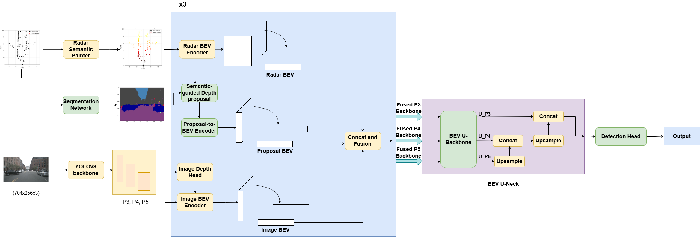
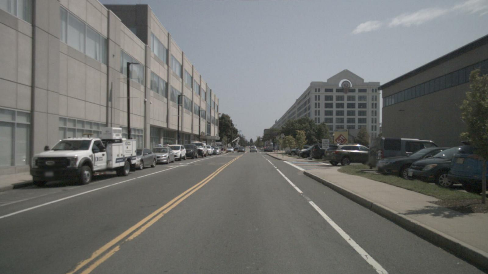
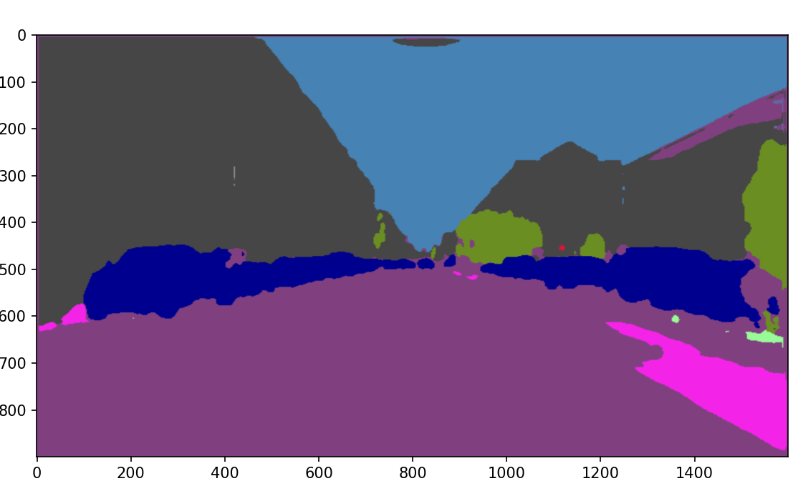
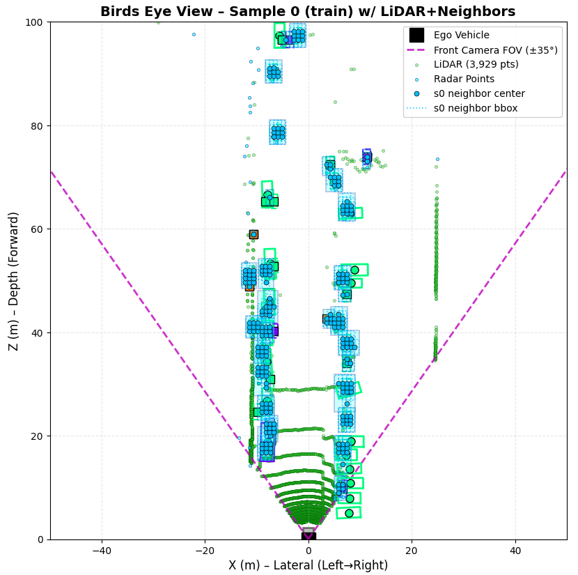

# YOLO-SemBEV
**YOLO-SemBEV** is a real-time 3D Bird's-Eye-View (BEV) occupancy and object detection framework for autonomous driving. It operates from a single front-facing camera and a single front-facing radar, achieving an end-to-end latency of **21 ms (47+ FPS)** on a single NVIDIA RTX A6000 GPU.

> **Paper:** YOLO-SemBEV: Semantic-Guided BEV Occupancy Detection using Single Camera and Radar (2026)
> **Code:** This repository | **Weights:** Download from Google Drive

***

## Highlights

- **Recall-first design** — foreground F1 of 0.684, Recall of 0.779 at 50 m range

- **21 ms end-to-end inference** — fastest in our comparison

 - **Single camera + single radar** — no surround-view rig required

- **Two variants:** YOLO-SemBEV (YOLOv8 backbone) and R-SemBEV (ResNet-101 backbone)


## Architecture Overview

YOLO-SemBEV consists of four key components:

1. **YOLOv8 Backbone + PAN Neck** — extracts multi-scale image features (P3/P4/P5) from the front camera

2. **Semantically Painted Radar Encoder** — projects radar point cloud into image feature space using a 2D segmentation prior, then encodes into BEV

3. **Sparse Semantic Proposal Encoder** — lifts 2D segmentation masks into 3D BEV space as spatial anchors for foreground objects

4. **Multi-scale BEV Neck + Detection Head** — fuses image BEV, radar BEV, and proposal BEV at three scales (128×128, 64×64, 32×32) for occupancy and 3D object detection

The 2D segmentation prior is provided by a frozen ResNet-UNet model pre-trained on Cityscapes.


## Results
### Qualitative Results

| Input Image | Segmentation Prior | BEV Prediction |
|:-----------:|:------------------:|:--------------:|
|  |  |  |
### Foreground Occupancy (nuScenes val, 50 m range)

| Model | Backbone | FG IoU | Pr | Rec | F1 | AP | Latency |
|-------|----------|--------|----|-----|----|-----|---------|
| YOLO-SemBEV | YOLOv8 | **0.258** | **0.609** | 0.779 | **0.684** | **0.328** | **21 ms** |
| R-SemBEV | ResNet-101 | 0.231 | 0.518 | **0.784** | 0.624 | 0.306 | 26 ms |

### Inference Latency vs. Baselines

| Method | Input | Latency |
|--------|-------|---------|
| MonoScene | 1C | ~870 ms |
| SurroundOcc | 6C | ~350 ms |
| CRN | 6C+6R | ~47 ms |
| RCBEVDet | 6C+6R | ~48 ms |
| **YOLO-SemBEV** | **1C+1R** | **21 ms** |

***
## Repository Structure
```

YOLO-SemBEV/
├── train.py                                  # Main training script
├── src/
│   ├── model_bev_seg12.py                    # YOLO-SemBEV full model (YOLOv8 backbone)
│   ├── model_bev_seg12_resnetbackbone.py     # R-SemBEV variant (ResNet-101 backbone)
│   ├── loss_bev_seg12.py                     # Loss functions (occupancy + detection)
│   └── dataset_loader_seg_large.py           # nuScenes dataloader with radar painting
├── requirements.txt
└── README.md
```
## Installation
```bash
# Clone the repository
git clone https://github.com/11rahi23/YOLO-SemBEV.git
cd YOLO-SemBEV

# Create conda environment
conda create -n yolosembev python=3.9 -y
conda activate yolosembev

# Install dependencies
pip install -r requirements.txt

```

This work is under review for publication.
<!--## Citation-->

<!--If you find this work useful, please cite:-->

<!--```bibtex-->
<!--@article{yolosembev2026,-->
  <!--title     = {YOLO-SemBEV: Semantic-Guided BEV Occupancy Detection-->
               <!--using Single Camera and Radar},-->
  <!--author    = {<Authors>},-->
  <!--journal   = {<Venue>},-->
  <!--year      = {2026}-->
<!--}-->
```
***


## License
This project is released under the MIT License.
